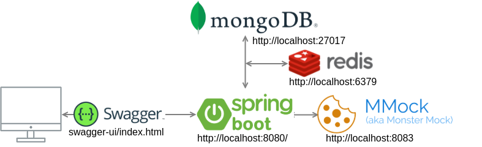

# spring boot starter
Starter project which contains examples with:
* Basic Rest CRUD examples
* Calling external api with RestTemplate
* Store cache in Redis
* MongoDB
* Coverage with jacoco > 80% lines covered required
* Swagger

# Swagger documentation
- http://localhost:8080/swagger-ui/index.html

# Pre requisites
- java 11
- docker
- docker-compose

# Start
- Start local mongodb, redis and mmock with `docker-compose up`

# Basic Diagram

# TODO
- functional test

# External links
- Monster Mock https://github.com/jmartin82/mmock
- https://stackoverflow.blog/2020/03/02/best-practices-for-rest-api-design/