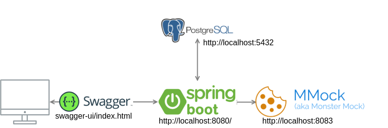

# spring boot starter
Starter project which contains examples with:
* Basic Rest CRUD examples
* Calling external api with RestTemplate
* PostgreSQL
* Coverage with jacoco > 80% lines covered required
* Swagger
* headers and spring boot filters
* jpa auditing

# Swagger documentation
- http://localhost:8080/swagger-ui/index.html
- put https://raw.githubusercontent.com/drog/spring-boot-starter/master/docs/swagger-api-docs.json in https://editor.swagger.io/

# Pre requisites
- java 11
- docker
- docker-compose

# Start
- Start local postgreSQL and mmock with `docker-compose up`

# Basic Diagram

# TODO
- fix test with redis in redis-implementation branch
- add Sonar in docker-compose
- generate random id
- check if meets twelve factor https://12factor.net/

# External links
- Monster Mock https://github.com/jmartin82/mmock
- Rest api best practices https://stackoverflow.blog/2020/03/02/best-practices-for-rest-api-design/
- Jpa auditing https://springbootdev.com/2018/03/13/spring-data-jpa-auditing-with-createdby-createddate-lastmodifiedby-and-lastmodifieddate/
- Swagger headers https://stackoverflow.com/questions/40801442/add-a-header-parameter-in-swagger-ui-documentation-with-springfox
- Exception Handler https://www.toptal.com/java/spring-boot-rest-api-error-handling
- Infinite loop problem https://newbedev.com/spring-data-jpa-bidirectional-relation-with-infinite-recursion